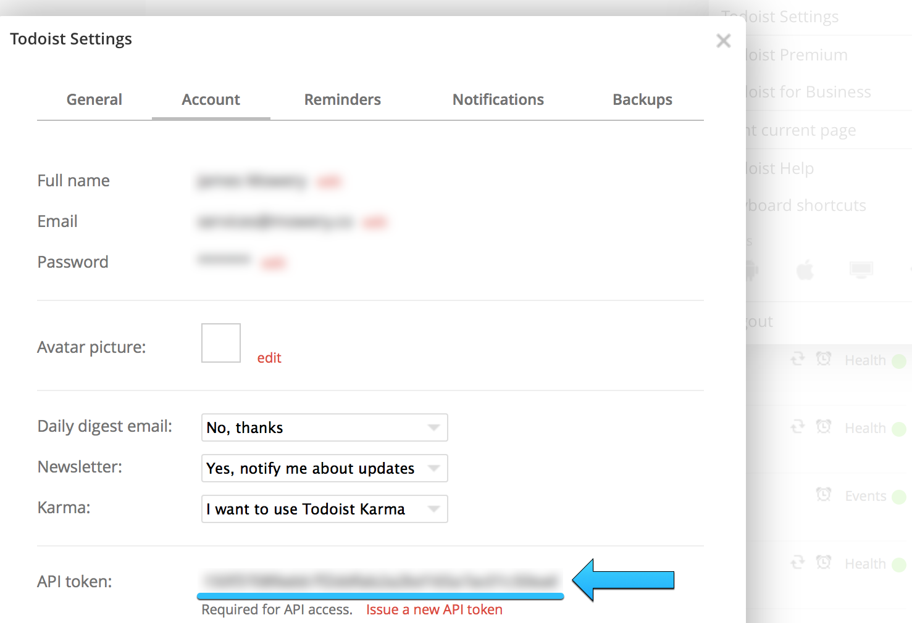

# Todoistify
**An Alfred Workflow for Todoist**

Todoistify is created and maintained by [James Mowery](http://mowery.co/).

## Overview

Todoistify is an Alfred (v2) Workflow that allows you to easily interact with [Todoist](https://todoist.com/).

## Initial Setup

The initial setup requires you to find your Todoist API key so that Todoistify can properly interact with your Todoist account.

### Locating your Todoist API key

* Login to the [Todoist website](https://todoist.com/)
* Go to Settings (located on the top right)
* Click on the "Account" tab
* Scroll to the bottom to locate your Todoist API token. 

### Adding your API token to Todoistify

* Open Alfred
* Type "todoconfig YOUR_API_TOKEN" (replacing "YOUR_API_TOKEN" with your API token you copied)
* Press the enter key
* Enjoy!

## Using Todoisifty

Type the following within Alfred to use Todoistify:

* **todo [YOUR_TASK_DESCRIPTION]**: Add a task to your inbox
* **todoweb**: Open Todoist in your default Web browser
* **todoconfig [YOUR_API_KEY]**: Add your API token to use Todoistify